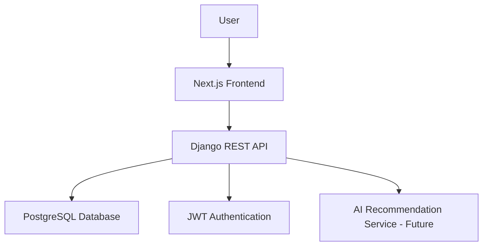

# System Architecture

## Frontend
Next.js application responsible for UI, authentication pages, dashboard, and job application management.

## Backend
Django REST API providing authentication, job application CRUD operations, and future recommendation logic.

## Database
PostgreSQL stores users, job applications, preferences, and future recommendation-related data.

## Future AI Layer
A recommendation engine will analyze a user's saved and applied jobs, preferences, and resume content to suggest relevant roles.
