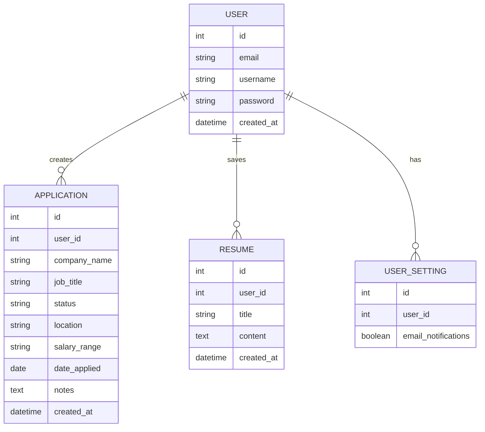

# Initial Database Schema

## Users
- id
- full_name
- username
- email
- password
- created_at

## JobApplications
- id
- user_id
- job_title
- company_name
- location
- job_url
- salary_range
- status
- date_applied
- notes
- created_at

## Resume
- id
- user_id
- title
- content
- created_at

## User Settings
- id
- user_id
- email_notif
